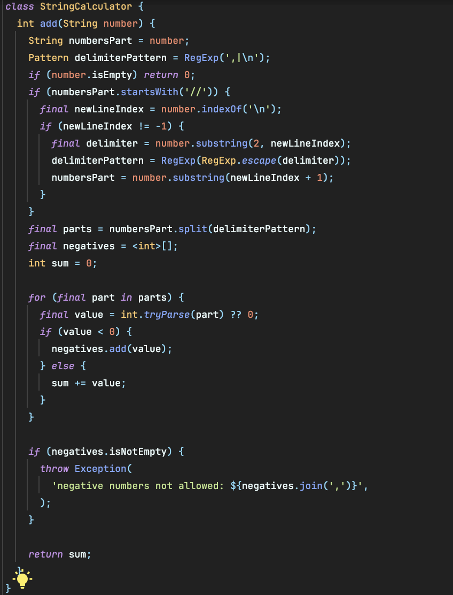
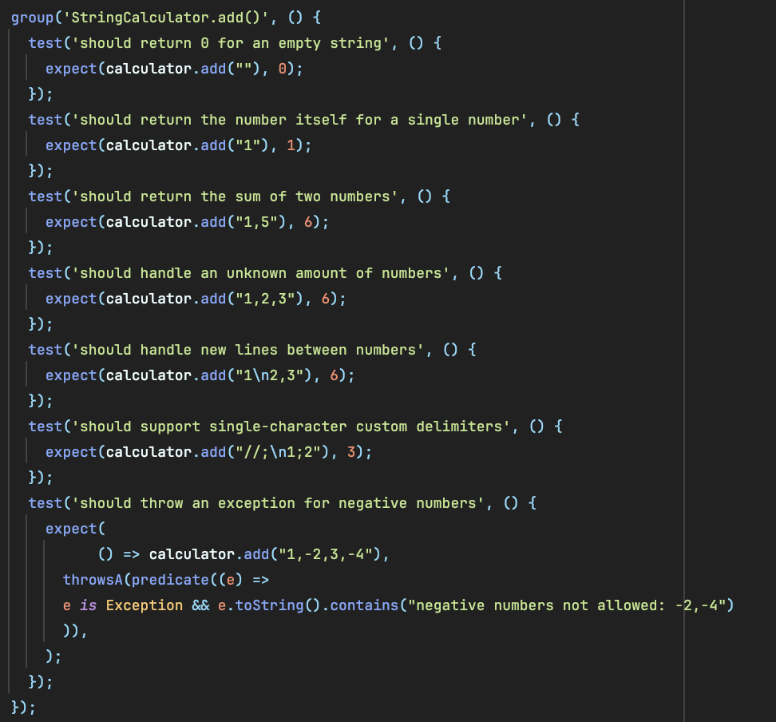

# String Calculator Kata (Dart)

A Test-Driven Development (TDD) implementation of the classic String Calculator Kata. This project demonstrates incremental development across five key milestones.

## 🚀 Features & Milestones

The following requirements have been implemented following the **Red-Green-Refactor** cycle:

1.  **Basic Addition**: Handles empty strings (returns 0), single numbers, and two numbers separated by commas.
2.  **Flexible Input**: Supports an unknown amount of numbers.
3.  **Newline Delimiters**: Handles newlines as valid delimiters between numbers (e.g., `"1\n2,3"` returns `6`).
4.  **Custom Delimiters**: Supports single-character custom delimiters defined at the start of the string (e.g., `"//;\n1;2"` returns `3`).
5.  **Negative Number Validation**: Throws an exception if negative numbers are provided, listing all negative numbers in the error message.

---

## 🛠 Project Structure

```text
lib/
 └── string_calculator.dart  # Core logic
test/
 └── string_calculator_test.dart # Unit tests for all steps

## 📸 Implementation Preview

Below are the snapshots of the current implementation and the test suite:

### Core Logic


### Test Suite Execution
